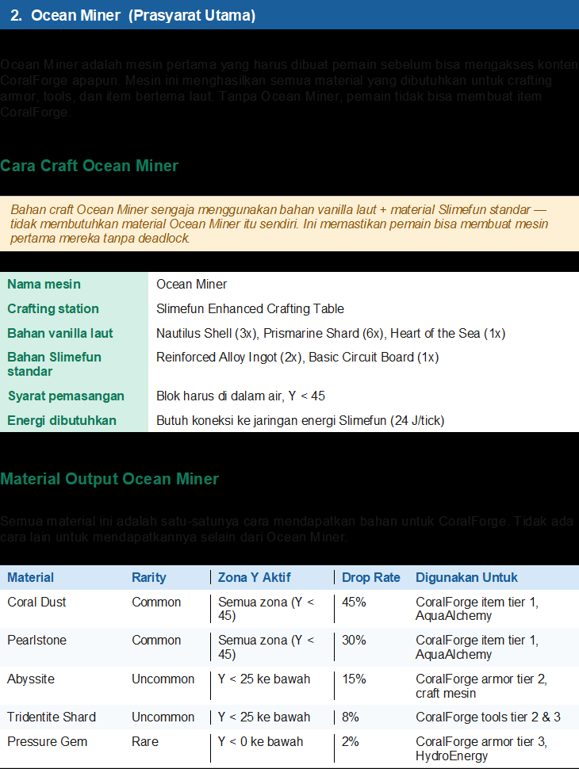

depensi wajib ini :

        <dependency>
            <groupId>net.guizhanss</groupId>
            <artifactId>GuizhanLibPlugin</artifactId>
            <version>1.8.1</version>
            <scope>provided</scope>
        </dependency>

        <dependency>
            <groupId>com.github.SlimefunGuguProject</groupId>
            <artifactId>Slimefun4</artifactId>
            <version>2024.3.1</version>
            <scope>provided</scope>
        </dependency